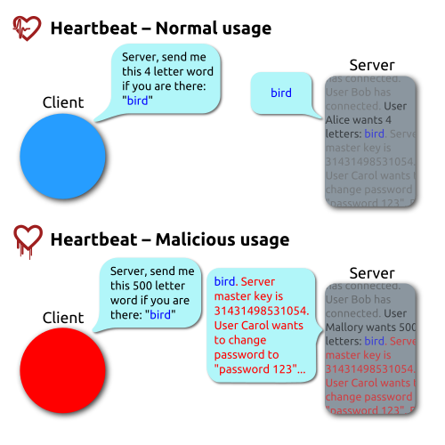

# What's fuzzing?

## Historical context

-   Researchers wanted to test the reliability of standard UNIX programs.
-   Formal methods were [and still are] not easy to apply to large systems.

-   One of the authors [Barton Miller, Lars Fredriksen, Bryan So] was working during a stormy night. The dial-up line noise cause additional symbols to appear on the terminal. The author noticed these extra symbols caused several programs to crash.

-   They were able to make them crash a 25-33% of them in any version of UNIX [1989], i.e., versions of BSD 4.2 and BSD 4.3.

It motivated the approach for software testing:

-   Construct a program to generate random characters
-   Construct programs to interact with the random generator

-   Identify the strings that crashes the programs
-   Identify the cause of the crash and categorize the mistakes

A program is detected as faulty only if it crashes or hangs (loops indefinitely).

-   Three are three recognizable states: 'crash', 'hang', and 'succeed'
-   It seems to me they were aiming to test the error recovery component of the software rather than test any other property.

## Definition

-   A fuzzer is a program which injects automatically semi-random data into a program/stack and detect bugs.
-   (Original concept from paper) Fuzzing is an approach to test the robustness of software applications using two programs: fuzz and ptyji

-   fuzz: generates a stream of random characters to be consumed by a target program
    -   allows printable and control characters
    -   can delay the insertion of elements in the sequence

-   ptyjig: tests interactive utility programs
    -   As some utility programs do not process standard input, ptyjig interfaces with these by creating a 'pseudo-terminal file'.

## Why is this approach useful?

The most common bugs found are related to assumptions on how the data will be presented and not enforcing additional checks for the latter. These were the following and/or associated to the following:

-   Pointer/Array: mostly related to bounded checking of collections

-   Dangerous input functions: gets() is considered harmful as it lacks mechanisms to enforce handling data or limited size.

-   Signed characters: incorrect use of casting or using characters in symbolic or numeric form

# Radamsa - Blackbox fuzzing

-   [Repo](https://gitlab.com/akihe/radamsa)
-   Installation:

    git clone https://gitlab.com/akihe/radamsa.git
    cd radamsa
    make
    sudo make install  

## Basic usage

-   How to use radamsa (as pipeline and reading files)

    echo "Hello, world!" | radamsa

## Simple examples

-   Using `radamsa` with  `jq`

    jq . test.json # Test if a json file is valid
    radamsa test.json | jq

    while true; do
      radamsa test.json > input.txt
      jq . input.txt > /dev/null 2>&1
      if [ $? -gt 127 ]; then
        cp input.txt crash-`date +s%.%N`.txt
        echo "Crash found!"
      fi
    done

# libFuzzer - Coverage guided fuzzing

libFuzzer comes installed with clang

-   On mac: `brew install llvm`
-   On linux: it works out-of-the box
-   Repos:
    -   [fuzzing](https://github.com/google/fuzzing)
    -   [fuzzer-test-suite](https://github.com/google/fuzzer-test-suite)

## Step 1: implement \`fuzz target\`,

A function that accepts an array of bytes and does something interesting with these bytes using the API under test.

    // fuzz_target.cc
    extern "C" int LLVMFuzzerTestOneInput(const uint8_t *Data, size_t Size) {
      DoSomethingInterestingWithMyAPI(Data, Size);
      return 0;  // Values other than 0 and -1 are reserved for future use.
    }

## Some requirements of the \`fuzz target\` function

-   The fuzzing engine will execute the fuzz target many times with different inputs in the same process.
-   It must tolerate any kind of input (empty, huge, malformed, etc).
-   It must not exit() on any input.
-   It may use threads but ideally all threads should be joined at the end of the function.
-   It must be as deterministic as possible. Non-determinism will make fuzzing inefficient.

-   It must be fast. Try avoiding cubic or greater complexity, logging, or excessive memory consumption.
-   Ideally, it should not modify any global state (although that’s not strict).
-   Usually, the narrower the target the better. E.g. if your target can parse several data formats, split it into several targets, one per format.

## Step 2: Fuzzer Usage

Build program with fuzzing options:

    clang -g -O1 -fsanitize=fuzzer                         mytarget.c # Builds the fuzz target w/o sanitizers
    clang -g -O1 -fsanitize=fuzzer,address                 mytarget.c # Builds the fuzz target with ASAN
    clang -g -O1 -fsanitize=fuzzer,signed-integer-overflow mytarget.c # Builds the fuzz target with a part of UBSAN
    clang -g -O1 -fsanitize=fuzzer,memory                  mytarget.c # Builds the fuzz target with MSAN

## Step 3: Define corpus

Test cases as seeds

## Hello-world example:

    /opt/homebrew/opt/llvm/bin/clang++ -g -fsanitize=address,fuzzer tutorial/libFuzzer/fuzz_me.cc -o fuzz_test  
    ./fuzz_test 

## Heartbleed example:

-   Run the build script in fuzzer-test-suite to compile the binary `openssl-1.0.1f-fsanitize_fuzzer`

    mkdir -p heartbleed; rm -rf heartbleed/*; cd heartbleed
    <fuzzer-test-suite>/openssl-1.0.1f/build.sh
    ./openssl-1.0.1f-fsanitize_fuzzer

# Conclusions

-   Fuzzing can be very useful as a cheap technique to discover bugs

-   Relatively easy to incorporate in code development

-   Sometimes, it might not provide any insights about issues in code

-   Definitely a strong tool if paired with debuggers, code tracers, etc

-   Many tools avaiable! Find the ones that suit your workflow

